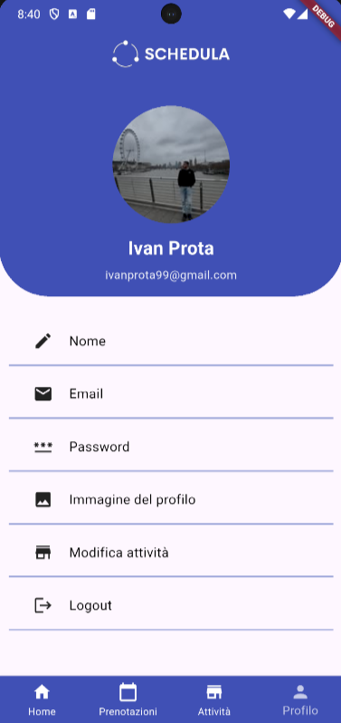
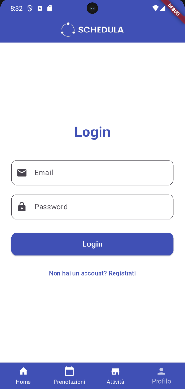

# 📅 Schedula

Schedula is a flexible appointment booking and management application designed to adapt to different types of businesses (e.g. salons, professional offices, service providers).

---

## 🚀 Tech Stack

* **Frontend:** Flutter (Dart)
* **Backend:** Spring Boot (Java)
* **Database:** H2

---

## 📦 Project Structure

```
schedula/
 ├── backend/   # Spring Boot REST API
 ├── frontend/  # Flutter application
```

---

## ⚙️ How to Run the Project

### 🔧 Backend (Spring Boot)

1. Navigate to the backend folder:

```bash
cd backend
```

2. Run the application:

**Linux / macOS**

```bash
./mvnw spring-boot:run
```

**Windows**

```bash
mvnw.cmd spring-boot:run
```

3. The backend will be available at:

```
http://localhost:8080
```

---

### 📱 Frontend (Flutter)

1. Navigate to the frontend folder:

```bash
cd frontend
```

2. Install dependencies:

```bash
flutter pub get
```

3. Run the app:

```bash
flutter run
```

---

## 🔗 Configuration

Make sure the frontend is configured to call the backend at:

```
http://localhost:8080
```

Update any API base URL in the code if needed.

---

## ✨ Features

* Appointment creation and management
* Business/activity management
* Booking visualization
* Clean and intuitive user interface

---

## 📸 Screenshots






---

## 📌 Requirements

Make sure you have installed:

* Java (version 17 or compatible)
* Flutter SDK
* Maven

---

## 👨‍💻 Author

* Ivan Prota
